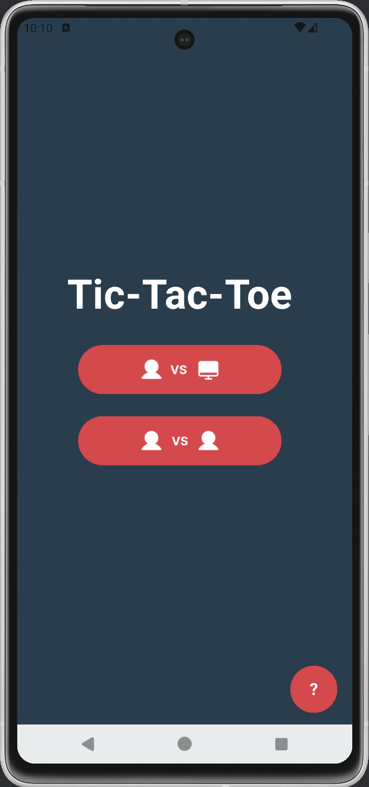
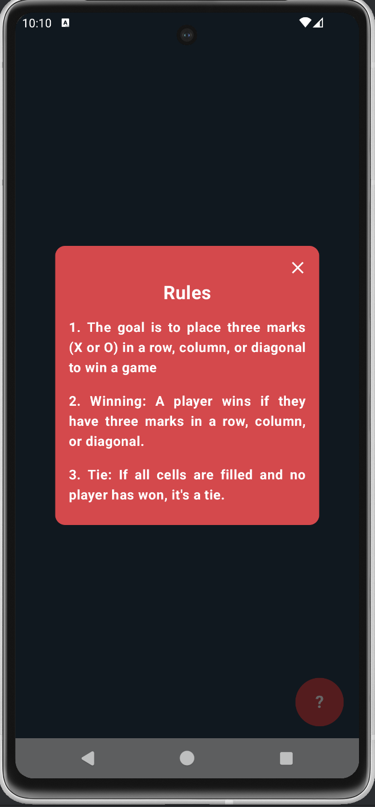
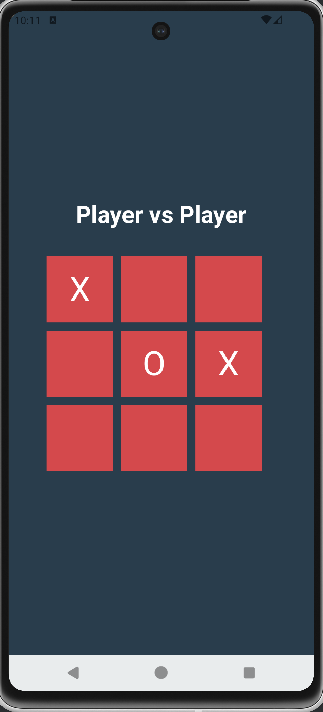
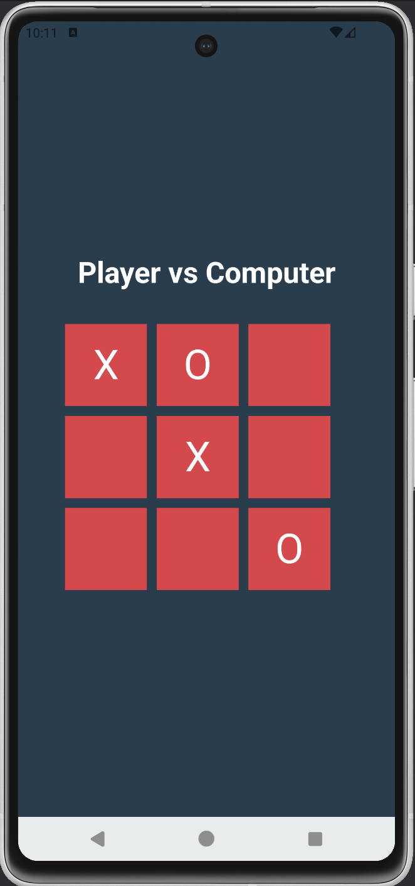
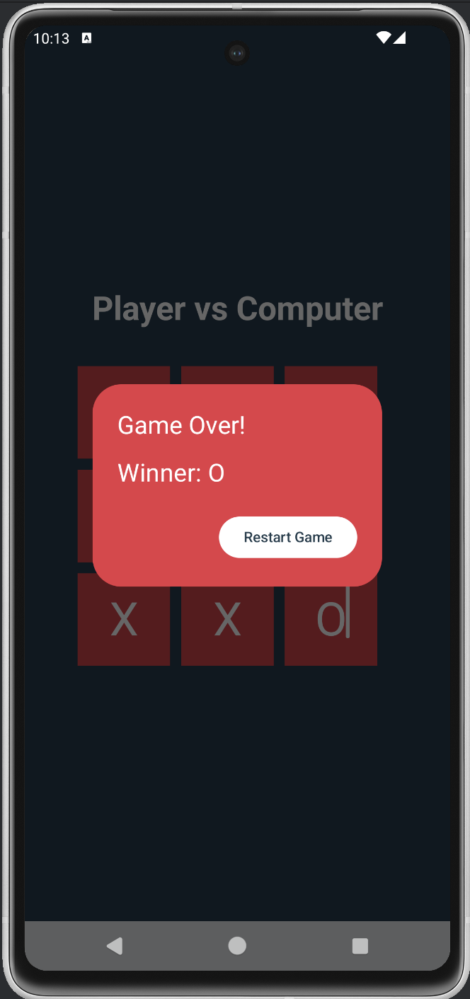
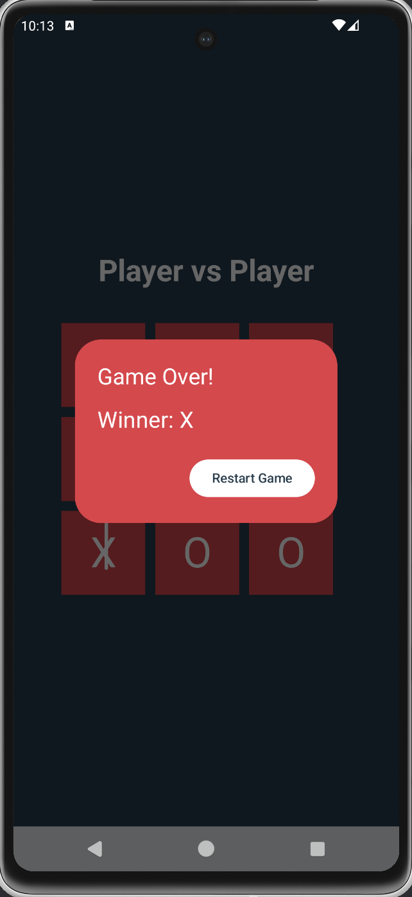

# Tic-Tac-Toe Game

This is a simple Tic Tac Toe game built using Kotlin and Jetpack Compose for Android. It supports two game modes:
- **Computer vs User** (single-player mode against AI)
- **Player 1 vs Player 2** (local multiplayer)

## Features
- 3x3 grid layout for the Tic Tac Toe board
- Two modes: Player vs Player & Computer vs User
- Game status display (winner)
- Game reset functionality
- Simple AI for the "Computer vs User" mode (random move)

## Demo








## Technologies Used
Kotlin, Jetpack-Compose

## Getting Started
- To get started with this project, clone this repository and open it in Android Studio.
```
  git clone https://github.com/AritraC1/TicTacToeGame.git
```

- Build and run the app on your android device.